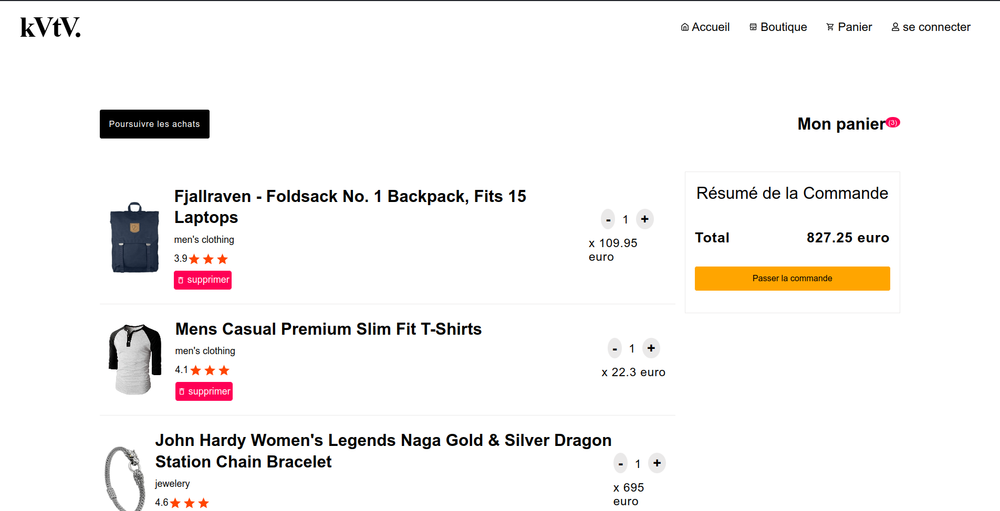
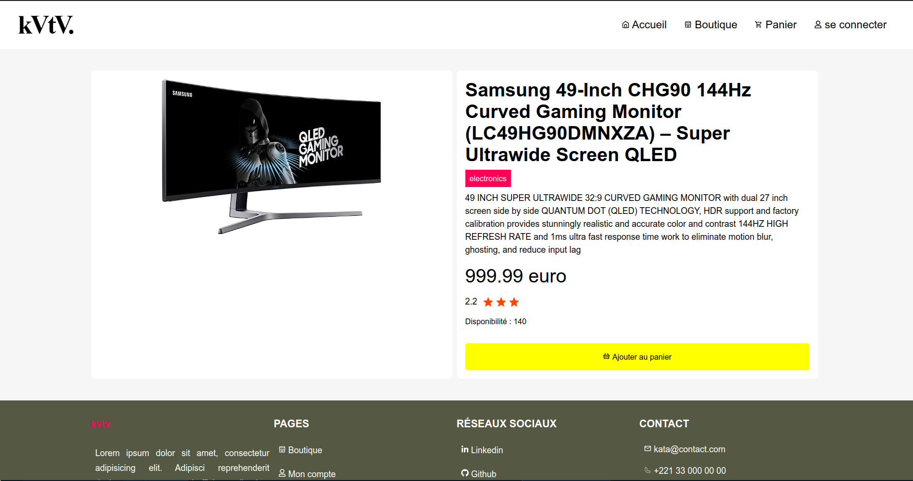

# 🛍️ Mini E-commerce Product Gallery Frontend Kata

Ce Kata est conçu pour évaluer votre capacité à construire une application web de commerce électronique de haute qualité, robuste, bien documentée, dynamique et interactive, utilisable sur une large gamme d'appareils et de navigateurs. Grâce à ce projet, vous démontrerez non seulement vos compétences en matière de développement, mais aussi votre engagement en faveur de l'excellence dans la qualité de l'application, grâce au respect des normes de codage et à l'alignement sur les meilleures pratiques pour une expérience optimisée et conviviale.

**Accèder à l'application** : https://kata-ecommerce.netlify.app/

### `Consommation de l'API`
Récupérer et afficher une liste de produits à partir de l'API Fake Store (`https://fakestoreapi.com/products`). 

### `Fonctionnalités`
- Affichages des produits
- Consulter un produit (détail)
- Ajouter un produit au **panier**
- Modifier le **panier**
- Supprimer un produit contenu dans **panier**
- Inventaire de la commande
- Rechercher un produit par son nom

### `Prerequis`
- *git >> 2.40*
- *nodejs >> 18.19*

### `Installation de l'application`
D'abord, il faut cloner le projet à l'aide de **git** dans votre répertoire de travail, par la commande :  
> git clone https://github.com/alphacpc/ecommerce-kata.git

Se déplacer dans le repo cloné
> cd ecommerce-kata

Installer les dépendances par la commande
> yarn

### `Lancer l'application`
> yarn start

Runs the app in the development mode.\
Open [http://localhost:3000](http://localhost:3000) to view it in your browser.

### `Captures`

  

  

### `Limite de l'application`
- Check endpoind : **detail/:id** Not OK, en cas de id inexistant

